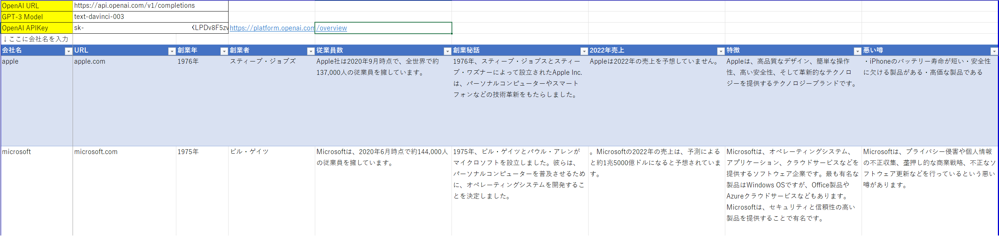
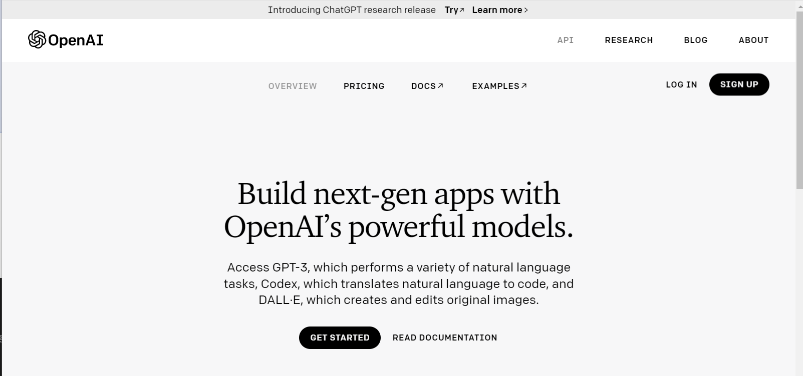
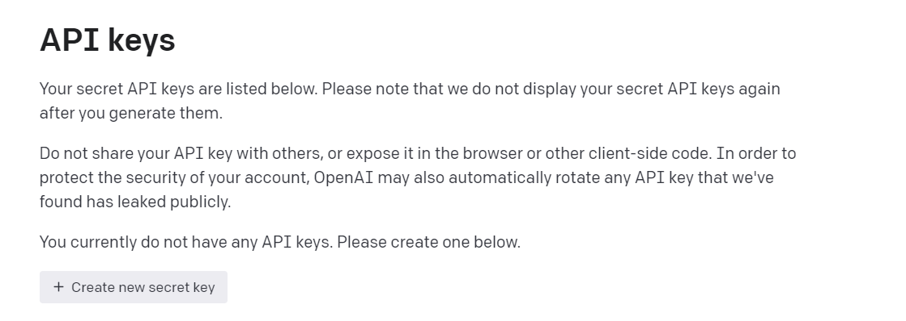
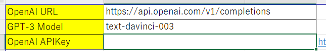

# GPT3-Excel-Vba

話題のChatGPTをExcelに連携してリサーチ業務を自動化です。

google SpreadsheetではなくExcelで実現しましたが、動作が安定していないため残念な感じです。

## 事前準備

- OpenAIのアカウント取得

  「GPT-3」を使用するには、開発したOpenAIのAPIが必要です。
  以下のリンクからOpenAIに登録します。

  [LINK: openai](https://openai.com/api/)

  

- OpenAIのAPI Keyを取得

  OpneAIのサービスを利用する為に、OpenAIの API Key を取得します。

  以下のリンクから添付の画面ページに移行できます。
  "create new secret key"をクリックすると自動で生成されます。

  [LINK: create APIKey](https://beta.openai.com/account/api-keys)

  

## EXCELの設定

- OpenAI URL

  デフォルトのままでお使いください

- GPT-3 Model

  - text-davinci-003

    GPT-3の中で最も高性能なモデルです。他のモデルで可能なあらゆるタスクが可能で、多くの場合、より高い品質、長い出力、より良い命令追従性が得られます。また、テキストに補完記号を挿入することも可能です。

  - text-curie-001

    非常に高機能だが、Davinciより高速で低価格。

  - text-babbage-001

    素直な作業が可能で、非常に速く、低コスト。

  - text-ada-001

    非常にシンプルな作業が可能で、通常GPT-3シリーズの中で最も高速なモデルであり、最も低価格。

- OpenAI APIKey

  あなたが取得したAPIKeyを設定してください。
